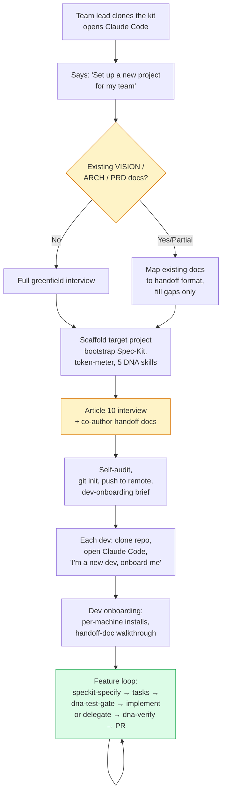

# agentic-dev-starter

Your team's developers use Claude Code without a shared contract for how the agent should work. Each dev has their own prompting habits, commit patterns, spec rigor. The agent behaves differently in every developer's hands. You can't review PRs against a standard that doesn't exist.

**agentic-dev-starter gives every agent on your team the same engineering contract** — spec-driven, test-first, token-aware, merge-conflict-free.

Point your CLI agent at this repo. Tell it to set up a new project for your team. The agent bootstraps a complete spec-driven development environment — Spec-Kit workflow, handoff documents, constitution, DNA enforcement skills, context management, token metering, and sub-agent orchestration. Same rules, every branch, every developer.

## How to use

1. Clone this repo:
   ```
   git clone https://github.com/albertdobmeyer/agentic-dev-starter.git
   ```

2. Open Claude Code (or any compatible CLI agent) with `agentic-dev-starter/` as the working directory:
   ```
   cd agentic-dev-starter && claude
   ```

3. Tell your agent what you want:
   - *"Read CLAUDE.md. Set up a new project for my team."* — interactive unfold, greenfield
   - *"Read CLAUDE.md. Here's my existing VISION doc — set up a project around it."* — bring your own planning material (PRD, architecture diagram, etc.)
   - *"Read CLAUDE.md. Explain the methodology."* — guided tour of the why
   - *"Read CLAUDE.md. Show me the team workflow."* — multi-dev coordination

No manual setup commands. The agent handles file scaffolding, Spec-Kit install (always latest), token-meter startup, the 5 DNA enforcement skills, Article 10 customization interview, handoff-doc authoring (gap-filling if you bring existing docs, full interview if greenfield), `git init`, remote push, and the per-dev onboarding brief you send your team.

## How it unfolds



Yellow nodes are where the human does real thinking. Green is the ongoing per-feature loop where the enforcement skills (DNA) and Spec-Kit keep the team on rails.

## What your agent becomes

| Without agentic-dev-starter | With agentic-dev-starter |
|---|---|
| Starts coding immediately | Plans first, builds second |
| Guesses when unclear | Stops and asks |
| Pleases the human | Pushes back when specs are violated |
| Tests are "optional" | `/dna-test-gate` — tests must exist and fail before implementation |
| "Done" without proof | `/dna-verify` — built matches specced, or divergences are listed |
| Blows past context limits | `/dna-context-check` — auto-handoff before the dumb zone |
| Merge conflicts from parallel work | `/dna-decompose` + `/dna-delegate` — scoped sub-agents, zero file overlap |

## Prerequisites

Your team lead's machine and each developer's machine need:
- [Claude Code](https://claude.ai/code) (or any compatible CLI agent — Cursor, Windsurf, etc.)
- `git`
- `uv` ([install guide](https://docs.astral.sh/uv/getting-started/installation/)) — the agent uses this to install Spec-Kit
- Node.js 18+ — the agent uses this to run the token-meter

The kit bundles nothing. Spec-Kit and agent-token-meter install on demand from their official sources, always at the latest version.

## Worked example

Want to see what the output looks like before running the kit yourself?

**[team-project-scheduler-example](https://github.com/albertdobmeyer/team-project-scheduler-example)** is a real Node/TypeScript team scheduler built through this kit: 5 merged features, a full 7-document Blueprint Package, two dogfood validation runs with session walkthroughs, and an open Construction Site (CS-002) demonstrating how the methodology catches partial-delivery of a `[D]`-depth scenario instead of hiding it.

Start with [its README](https://github.com/albertdobmeyer/team-project-scheduler-example#readme) for a guided reading path. Longer narrative: [docs/WORKED_EXAMPLE.md](docs/WORKED_EXAMPLE.md).

## Deep dives

For humans who want to understand why the rules exist:

[Methodology](docs/METHODOLOGY.md) | [Team Guide](docs/TEAM_GUIDE.md) | [Field Notes](docs/FIELD_NOTES.md) | [Planning Instructions](docs/PLANNING_INSTRUCTIONS.md) | [Handoff Format](docs/HANDOFF_FORMAT.md) | [FAQ](docs/FAQ.md) | [Worked Example](docs/WORKED_EXAMPLE.md)

---

> Created by Albert Dobmeyer & Claude (Anthropic) — AKD AUTOMATION SOLUTIONS
> Built on [Spec-Kit](https://github.com/github/spec-kit) (MIT) + Claude Code best practices by Boris Cherny (Anthropic)
> Licensed under [CC BY-SA 4.0](LICENSE) | Companion: [agent-token-meter](https://github.com/albertdobmeyer/agent-token-meter)
