# agentic-dev-starter

   

A methodology kit for teams using AI coding agents (Claude Code, Cursor) on real products. It gives every developer, junior or senior, the same engineering contract: spec driven, test first, drift resistant, merge conflict free.

**Quick start** (one command, around 260 KB):
```bash
npx tiged albertdobmeyer/agentic-dev-starter/template my-project            # Claude Code
npx tiged albertdobmeyer/agentic-dev-starter/adapters/cursor/payload my-project  # Cursor
```
Then open the agent and say *"Read CLAUDE.md. Set up a new project for my team."* (Cursor users: *"Read CURSOR.md..."*). A real worked example lives at [team-project-scheduler-example](https://github.com/albertdobmeyer/team-project-scheduler-example) with 6 shipped features, full Blueprint, and dogfood evidence.

## What it fixes

Five failure modes common to team scale agentic development:

| Failure mode | How this kit addresses it |
|---|---|
| **Manual PR review burden.** Team lead becomes a bottleneck reading every line of agent generated code. | `dna-verifier` subagent walks every scenario against the built code and emits CONGRUENT or DIVERGENT. The human reviews the verdict, not the diff. |
| **Merge conflicts from parallel junior work.** Two agents edit the same shared file on different branches. | `dna-cross-checker` parses "Files this feature will touch" across every open spec and blocks collisions before branches are cut. |
| **Drift: built does not match spec.** Agent implementation diverges from the specification, nobody notices until production. | `dna-verify` (mechanical: coverage plus integration tests plus scenario references) and `dna-verifier` (judgmental: fresh context scenario walk). |
| **Flattening: `[D]` shipped as `[W]`.** Rich scenarios silently reduced to shallow component implementations during task decomposition. | Depth tagging (`[E]`, `[W]`, `[D]`), Construction Sites living tracker, and `dna-spec-validator` judgmental gate distinguishing legitimate scope deferral from drift. |
| **Juniors stuck in one shot prompt and hope.** Dev asks the agent for a feature, hopes for the best, no methodology. | 12 step per feature workflow enforced by 6 executable gates plus 5 fresh context judgment subagents. No step is skippable. |

## How it works

Three layers stacked:

1. **Spec-Kit (the engine).** GitHub's [Spec-Kit](https://github.com/github/spec-kit) drives the specify, plan, tasks, implement workflow. Slash commands `/speckit-specify`, `/speckit-plan`, `/speckit-tasks`. Installed automatically at Bootstrap and pinned at install time.
2. **DNA enforcement layer (the guardrails).** 6 executable gates (`dna-test-gate`, `dna-verify`, `dna-decompose`, `dna-delegate`, `dna-context-check`, `dna-spec-validate`) plus 5 judgmental subagents (`dna-cross-checker`, `dna-spec-auditor`, `dna-spec-validator`, `dna-verifier`, `dna-construction-logger`). Each runs at a specific point in the workflow. The judgmental subagents run in fresh context so the builder does not grade its own work.
3. **7-doc Blueprint Package (the contract).** `docs/00-CORE-PRINCIPLES.md` through `docs/05-CONSTRUCTION-SITES.md` plus root `CONSTITUTION.md`. Authored during Bootstrap with the team lead. Becomes the binding reference every subsequent feature is specified and verified against.

**Companion tools** — both are highly recommended and serve integrated roles in the workflow. Not bundled; each installs on demand via `npx`:

- **[agent-token-meter](https://github.com/albertdobmeyer/agent-token-meter)** — real-time token burn dashboard. `dna-context-check` reads it to decide *when* to hand off between sessions.
- **[claude-mem](https://github.com/thedotmack/claude-mem)** — persistent session memory for Claude Code. Automatically captures what happened each session and makes it searchable in the next one. Pairs with `dna-context-check`'s handoff protocol to carry context across session boundaries so the next session picks up from exactly where the last one stopped.

## Install

One command, no git clone, around 260KB payload.

**For Claude Code:**
```bash
npx tiged albertdobmeyer/agentic-dev-starter/template my-new-project
cd my-new-project
claude
```

**For Cursor:**
```bash
npx tiged albertdobmeyer/agentic-dev-starter/adapters/cursor/payload my-new-project
cd my-new-project
cursor .
```

Then, in the agent:

> *"Read CLAUDE.md. Set up a new project for my team."* (Claude Code)
> *"Read CURSOR.md. Set up a new project for my team."* (Cursor)

The agent runs the Bootstrap flow: installs Spec-Kit, verifies the DNA enforcement layer, co-authors the 7-doc Blueprint Package with the team lead (interviewing for what the product is, what it must do, how it should behave), customizes `CONSTITUTION.md` Article 10 for the team's quality rules, runs a self audit, initializes git, and outputs a dev onboarding brief to send each developer.

## The fold

This kit is intentionally small. The full unfold sequence happens inside the target project, driven by the agent. The kit repo contains:

```
agentic-dev-starter/
├── template/                   the folded seed (Claude Code payload; ~260KB)
├── adapters/cursor/payload/    the folded seed (Cursor payload)
├── adapters/{amp,codex}/       stubs for future adapters
├── kernel/                     agent agnostic methodology, vocabulary, role taxonomy
├── docs/                       methodology reference (for humans learning the kit)
├── tools/                      kit maintenance scripts
└── CLAUDE.md                   Protocol A through E for agents operating ON the kit itself
```

Only `template/` (or `adapters/cursor/payload/`) unfolds into a target. Everything else is the workshop's operating manual, read by people teaching, porting, or maintaining the methodology. Not shipped to targets.

## How a feature ships

Once the kit is unfolded and the Blueprint is authored, every feature follows the same 12 step loop:

```mermaid
flowchart LR
    A[specs/NNN-*/ dir<br/>+ branch]
    B[dna-cross-checker<br/>shared-file collision]
    C[/speckit-specify/]
    D[dna-spec-auditor<br/>20+ quality checks]
    E[dna-spec-validate<br/>+ dna-spec-validator]
    F[/speckit-plan /<br/>speckit-tasks/]
    G[dna-decompose<br/>+ dna-delegate]
    H[dna-test-gate<br/>red phase]
    I[Implement<br/>one file per prompt]
    J[dna-verify<br/>+ dna-verifier]
    K[Merge + Construction Site<br/>logged if depth downgrade]

    A --> B --> C --> D --> E --> F --> G --> H --> I --> J --> K
    style E fill:#fef3c7,stroke:#d97706
    style J fill:#dcfce7,stroke:#16a34a
    style K fill:#fee2e2,stroke:#991b1b
```



Yellow: judgmental gates that catch drift before implementation. Green: post build verification. Red: honest depth accounting.

## What your agent becomes

| Without this kit | With this kit |
|---|---|
| Starts coding immediately | Plans first, builds second (Spec-Kit enforces the order) |
| Guesses when unclear | Stops and asks. Ambiguity is a spec defect, fixed in the spec |
| Pleases the human | Pushes back with citation + options when specs are violated |
| Tests are optional | `dna-test-gate`: tests must exist and fail before implementation proceeds |
| "Done" without proof | `dna-verify` + `dna-verifier`: built matches specced, or divergences are listed |
| Silent scope reduction | `dna-construction-logger`: every `[D]` to `[W]` downgrade logged at the moment it happens |
| Blows past context limits | `dna-context-check`: auto handoff before the dumb zone |
| Merge conflicts from parallel work | `dna-decompose` + `dna-delegate`: scoped sub agents, zero file overlap |

## Worked example

A complete project built through this kit lives at [team-project-scheduler-example](https://github.com/albertdobmeyer/team-project-scheduler-example). It is a Node/TypeScript team scheduler with 6 merged features, a full 7-doc Blueprint Package, three dogfood validation sessions, and one resolved Construction Site. Start with [its README](https://github.com/albertdobmeyer/team-project-scheduler-example#readme) for a 45 minute evaluator pass. Longer narrative at [docs/WORKED_EXAMPLE.md](docs/WORKED_EXAMPLE.md).

## Prerequisites

Each developer's machine needs:
- [Claude Code](https://claude.ai/code) or [Cursor](https://cursor.com). Other agents (Amp, Codex) have stub adapters pending.
- `git`
- `uv` ([install guide](https://docs.astral.sh/uv/getting-started/installation/)) for the Spec-Kit CLI
- Node.js 18+ for `npx tiged`, agent-token-meter, and claude-mem

The kit bundles nothing. Spec-Kit, agent-token-meter, and claude-mem install on demand from their official sources, always at the latest version.

## Deep dives

For humans who want to understand why the rules exist:

[Methodology](docs/METHODOLOGY.md) · [Team Guide](docs/TEAM_GUIDE.md) · [Field Notes](docs/FIELD_NOTES.md) · [Planning Instructions](docs/PLANNING_INSTRUCTIONS.md) · [Handoff Format](docs/HANDOFF_FORMAT.md) · [FAQ](docs/FAQ.md) · [Worked Example](docs/WORKED_EXAMPLE.md)

For contributors adding adapters (Cursor, Amp, Codex) or extending the methodology:

[Kernel: methodology](kernel/methodology.md) · [Kernel: roles](kernel/roles.md) · [Kernel: vocabulary](kernel/vocabulary.md) · [Adapter contract](adapters/README.md) · [CONTRIBUTING](CONTRIBUTING.md)

## Origin and credit

An iterative synthesis of spec driven development patterns validated on multiple production builds. Built on top of [Spec-Kit](https://github.com/github/spec-kit) (GitHub, MIT) and Claude Code best practices.

Contributors: Albert Dobmeyer, with Claude (Anthropic) as co-architect during methodology refinement.

Licensed under [CC BY-SA 4.0](LICENSE). Companion tools: [agent-token-meter](https://github.com/albertdobmeyer/agent-token-meter) · [claude-mem](https://github.com/thedotmack/claude-mem).
